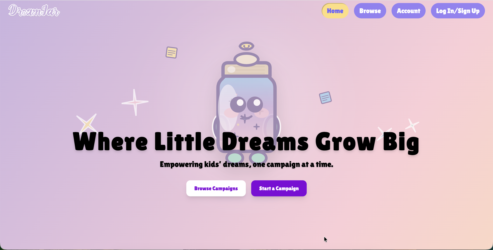
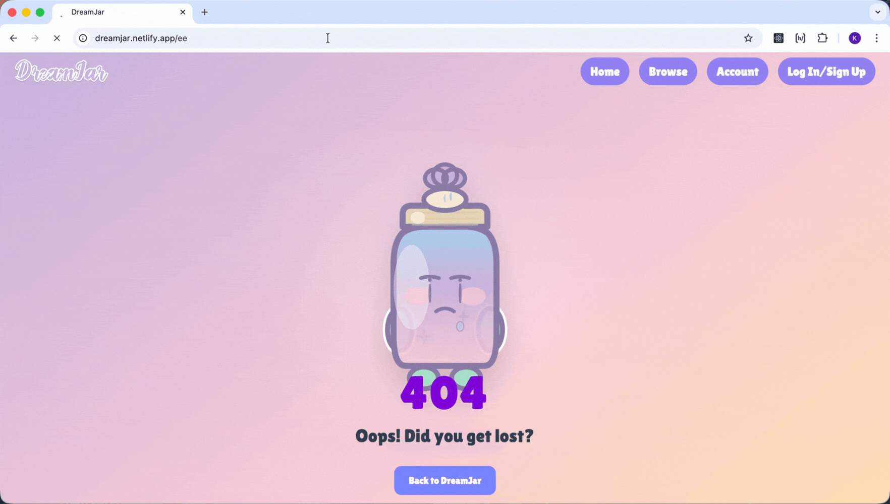

# DreamJar - A React Project




### A Magical Crowdfunding Platform for Kids with Big Dreams

> Where imagination meets action — and every dream has a jar to fill.

DreamJar is a full-stack crowdfunding application designed specifically for children and families. While inspired by platforms like Kickstarter and GoFundMe, DreamJar reimagines the experience for a younger audience — focusing on goal-setting, visual progress tracking, and financial literacy in a safe, parent-managed environment.

This project demonstrates full-stack integration between a Django REST Framework API and a React frontend, with secure token authentication, permission-based logic, and responsive UI design.

---

## 🚀 Live Demo

🔗 **Deployed Frontend:** _[https://dreamjar.netlify.app/]_  

---

## 🎯 Target Audience

DreamJar is designed for:

- 👨‍👩‍👧 Parents supporting their children’s goals  
- 🧒 Kids saving for meaningful purchases or creative projects  
- 🎓 Families teaching financial literacy in an engaging way  

Unlike traditional crowdfunding platforms that prioritize transactions, DreamJar emphasizes:

- Visual goal progression  
- Safe, simulated pledging  
- Parent-guided campaign management  
- A playful but structured experience  

---

## 🛠 Tech Stack

### Frontend
- React
- React Router
- Context API for global authentication state
- Custom Hooks for API interactions
- Token-based authentication
- Framer Motion for animation
- Responsive CSS & Tailwind

### Backend
- Django
- Django REST Framework
- Token Authentication
- Custom permission classes
- Relational data modeling
- Google integration (Login/Signup)

---

## ✨ Core Features

### 👤 User Accounts
- Secure registration and login
- Token-based authentication
- Persistent session handling
- Conditional UI rendering based on auth state

The user dashboard includes the following functionality:
- Children Tab
  - Create, edit and delete Children
  - Create campaigns under each child
    - Campaign Edit, Delete, Close/Re-open functions
    - Animated progress bars for each campaign
  - Stat Cards:
    - Total Children
    - Total Dreamjars
    - Total Raised
- Donation Tab
  - Overview of donation history made by user, descending from most recent
  - Click on any donation you've made to visit that campaign page
  - Stat Cards:
    - Total Donations
    - Total Donated
- Settings Tab
  - Edit user details (Name, username, password)
  - Delete user
  - Toggles (future functionality)
    - Email Notifications (future)
    - Private Profile (future)

---

### 🏷 Campaign Management

Authenticated users can create fundraising campaigns including:

- Title  
- Description  
- Image  
- Goal amount
- Deadline  
- Open/closed status  
- Created date  
- Owner relationship  

Campaign owners can:
- Edit their campaigns  
- Delete their campaigns  
- Toggle open/closed state  

Proper permission enforcement prevents unauthorized edits.

---

### 💛 Donation System

Authenticated users can donate to open campaigns with:

- Donation amount  
- Comment  
- Anonymous option  
- Associated supporter (user)  
- Linked campaign  

Permissions:
- Logged-in user details are auto-populated in Donation fields
- A donor does not need to have a user account in order to donate
---

## 🔐 Authentication & Authorization

- Token Authentication implemented via Django REST Framework
- Secure API endpoints
- Conditional rendering based on user identity
- Protected routes in React
- Appropriate HTTP status codes returned for success and failure
- Custom 404 page for undefined routes

---

## 📱 Responsive Design

Key considerations:
- Flexible layout structure
- Mobile navigation (including hamburger menu)
- Responsive typography
- Scalable component structure
- Smooth animations without sacrificing performance

---

## 🖼 Screenshots

### 🏠 Homepage  


---

### ➕ Campaign Browse Page  


---

### 📝 Campaign Page


---

### 🌟 Campaign Donations 


---

### 🎛️ User Dashboard


---

### 🪪 Dashboard Tabs


---

### 🚫 Custom 404


---

## 🧪 Running Locally (Frontend Only)

### Prerequisites
- Node.js (v18+ recommended)
- npm or yarn

### Installation Steps

```bash
# Clone the repository
git clone <your-repo-url>

# Navigate into the frontend directory
cd dreamjar-frontend

# Install dependencies
npm install

# Start development server
npm run dev
```

The app will run locally at _[http://localhost:5173]_

🔗 **Backend repo:** _[https://github.com/thisiskaysis/DreamJar_backend]_  


> ⚠️ Note: You will need a running instance of the DreamJar backend API for full functionality. Update your API base URL if necessary.

---

## 🏗 Architecture Overview

React Frontend
↓
Django REST API
↓
Relational Database


### Backend Relationships

- User → Child (1-to-many)
- Child → Campaign (1-to-many)
- Campaign → Donation (1-to-many)
- User → Donation (1-to-many)

The frontend consumes RESTful endpoints and manages authentication state via Context API.

---

## 📚 What I Learned

Building DreamJar strengthened my understanding of:

- Designing and consuming RESTful APIs  
- Implementing secure token-based authentication  
- Structuring scalable React component hierarchies  
- Managing global state cleanly with Context API  
- Separating UI logic from data-fetching logic  
- Implementing permission-aware rendering  
- Handling async flows and error states gracefully  
- Thinking beyond functionality into user experience design  

Most importantly, I learned how to bridge backend architecture decisions with frontend UX implementation — ensuring both layers work cohesively.

---

## 🌟 What Makes DreamJar Different?

Unlike traditional crowdfunding platforms:

- Designed specifically for children and families  
- Emphasizes financial literacy over transactions  
- Focuses on visual progress and goal-setting  
- Simulates real-world crowdfunding logic in a safe environment  

DreamJar balances creativity with robust engineering principles.

---

## 🧩 What This Project Demonstrates

- Full-stack integration  
- Secure authentication handling  
- Permission-aware API design  
- Clean component architecture  
- Responsive UI implementation  
- Real-world application flow  
- Clear separation of concerns  
- Thoughtful user experience decisions  

---

## 👩‍💻 About the Developer

I’m a developer who blends creative thinking with structured engineering. I enjoy building applications that feel intentional — where architecture, UX, and logic align cleanly.

DreamJar reflects my approach to development:

- Scalable structure  
- Clear data flow  
- Secure authentication practices  
- UI personality without sacrificing maintainability  

---

## ⚠️ Disclaimer

This project simulates crowdfunding functionality.  
No real financial transactions occur.

---

## Made With 💜
