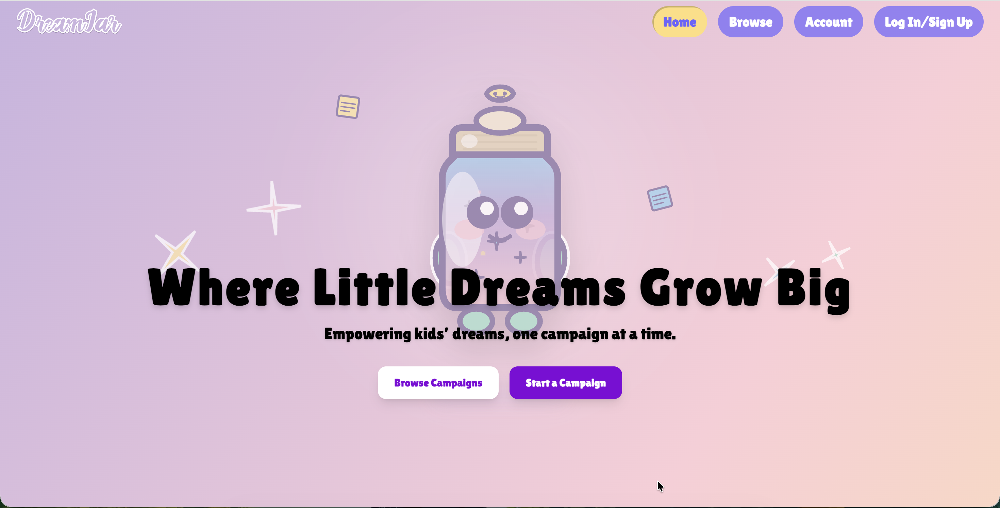
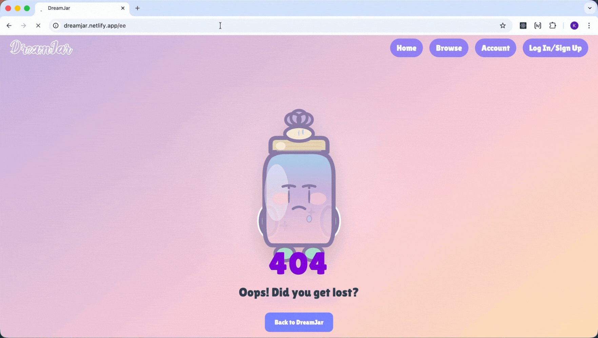

# DreamJar – React Frontend / Django Backend




---

### A Full-Stack Crowdfunding Platform for Kids and Families

DreamJar is a full-stack crowdfunding app built to help children and families manage, track, and achieve goals. I developed the **React frontend** and integrated it with a **Django REST Framework backend**, implementing secure token authentication, permission-aware dashboards, responsive UI, and smooth animations.  

This project highlights **full-stack development, state management, async API handling, and UX-focused engineering**.

---

## 🚀 Live Demo

🔗 **Frontend:** [https://dreamjar.netlify.app/](https://dreamjar.netlify.app/)  

---

## 🎯 Core Skills Demonstrated

- **Frontend (React)**:  
  - Component design for dashboard, campaigns, donations  
  - Context API for global state  
  - Custom hooks for API interactions  
  - Responsive layout with Tailwind CSS  
  - Framer Motion animations  

- **Backend (Django + DRF)**:  
  - Token-based authentication  
  - Permission-aware API endpoints  
  - Relational models: User → Child → Campaign → Donation  
  - Campaign and donation logic enforcement  

- **UX & Functionality**:  
  - Multi-tab dashboard (Children, Donations, Settings)  
  - Campaign creation, editing, closing, deletion  
  - Donation system with optional anonymity  
  - Mobile-first responsive design  

---

## 🖼 Screenshots / GIFs

### 🏠 Homepage  


### ➕ Campaign Browse Page  


### 📝 Campaign Page  


### 🌟 Campaign Donations  


### 🎛️ User Dashboard  


### 🪪 Dashboard Tabs  


### 🚫 Custom 404  


---

## 🧪 Running Locally (Frontend Only)

### Prerequisites
- Node.js (v18+ recommended)
- npm or yarn

### Installation Steps

```bash
# Clone the repository
git clone <your-repo-url>

# Navigate into the frontend directory
cd dreamjar-frontend

# Install dependencies
npm install

# Start development server
npm run dev
```


The app runs locally at _[http://localhost:5173]_  

🔗 **Backend repo:** [https://github.com/thisiskaysis/DreamJar_backend](https://github.com/thisiskaysis/DreamJar_backend)  

> ⚠️ Note: Full functionality requires a running backend instance. Update your API base URL if necessary.

---

## 🏗 Architecture Overview

React Frontend  
↓  
Django REST API  
↓  
Relational Database  

### Backend Relationships
- User → Child (1-to-many)  
- Child → Campaign (1-to-many)  
- Campaign → Donation (1-to-many)  
- User → Donation (1-to-many)  

---

## 🌟 Achievements / What I Built

- **Full-stack integration** with React and Django REST Framework  
- **Token-based authentication** with protected routes and permission logic  
- **Component hierarchy** with Context API for state management  
- **Async API handling** with error states  
- **Responsive design** for desktop and mobile  
- **Animations and UX polish** using Framer Motion  
- **Permission-aware dashboards** for campaign and donation management  

This shows real-world **frontend-backend problem solving**, secure design, and clean, maintainable code.

---

## 📚 Key Learnings

- Designing and consuming RESTful APIs  
- Implementing secure token-based authentication  
- Structuring scalable React component hierarchies  
- Managing global state cleanly with Context API  
- Separating UI logic from data-fetching logic  
- Handling async flows and errors gracefully  
- Thinking about UX beyond just functionality  

---

## 🌟 What Makes DreamJar Different?

- Designed for children and families  
- Emphasizes financial literacy over pure transactions  
- Visual goal-tracking and playful UI  
- Parent-managed campaign oversight  
- Secure simulated crowdfunding experience  

---

## 👩‍💻 About Me

I’m a developer who blends **creative thinking** with **structured engineering**. DreamJar reflects my approach:

- Clean, scalable code  
- Secure authentication practices  
- Intentional UX  
- Thoughtful separation of frontend and backend logic  

---

## ⚠️ Disclaimer

This project simulates crowdfunding functionality. No real financial transactions occur.  

---

✅ Made With 💜
